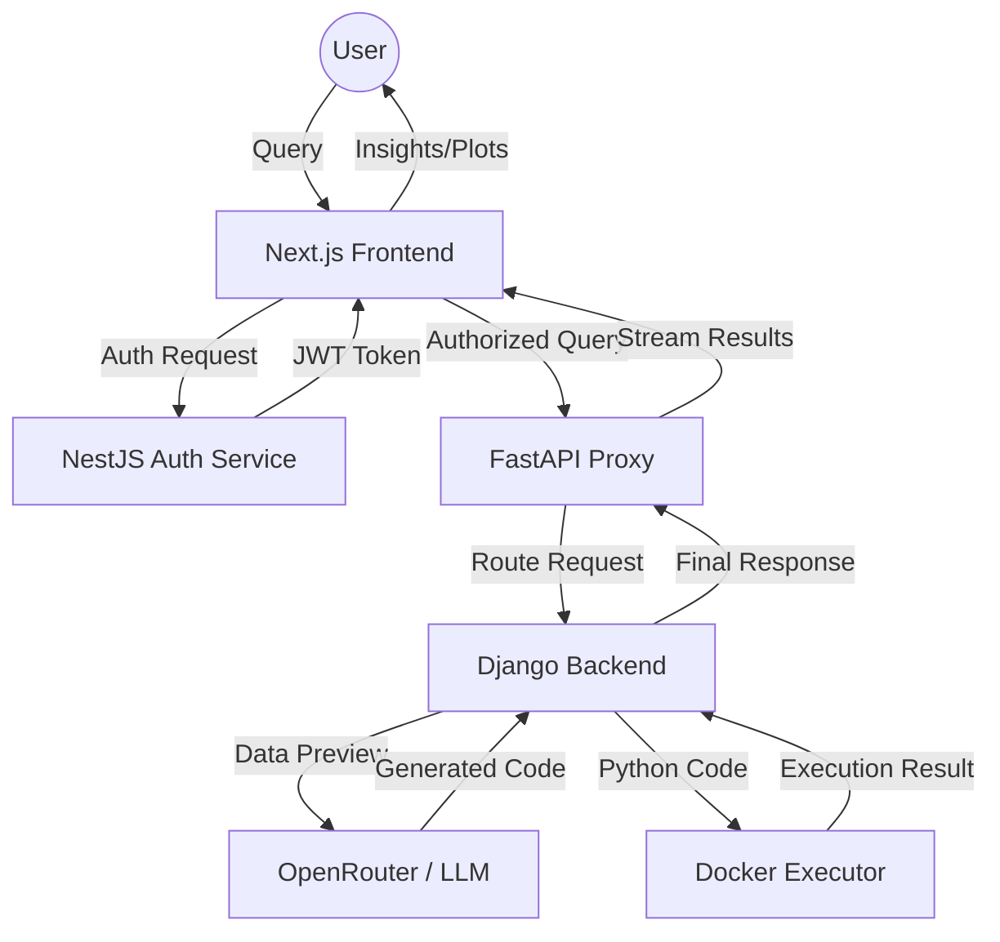

# AxnosAI - Intelligent Data Copilot 🚀

AxnosAI is a next-generation, AI-powered data exploration platform that allows users to interact with their datasets using natural language. It translates complex user queries into intelligent data operations, providing instant insights through a modular microservices architecture.

---

## 🌟 Key Features

- **Natural Language Data Analysis**: Chat with your data as if you're talking to a data scientist.
- **Multi-Format Support**: Seamlessly handle CSV, Excel, JSON, and PDF files.
- **Database Connectivity**: Connect directly to SQL databases for real-time analysis.
- **Code Generation & Execution**: Automatically generates Pandas code and executes it in secure, isolated Docker containers.
- **Multi-LLM Support**: Powered by OpenRouter, allowing you to choose between Mistral, DeepSeek, Llama 3.1, and GPT-4o Mini.
- **Interactive UI**: A sleek, responsive dashboard built with Next.js and Tailwind CSS.

---

## 📂 Project Structure

```text
AxnosAI/
├── auth-service/                # NestJS authentication service
├── main-backend-service/        # Django core logic & chat management
│   ├── chat_config/             # Chat history & naming logic
│   ├── code_execution/          # Docker-in-Docker execution logic
│   ├── code_generation/         # OpenRouter LLM integration
│   ├── core/                    # Django settings & URL routing
│   └── data_config/             # Database & Supabase configurations
├── proxy-orchestration-server/  # FastAPI request router
├── Axnos-UI/ (External)         # Next.js frontend application
└── docker-compose.yml           # Full stack orchestration
```

---

## 🔄 Information Flow

The following diagram illustrates how a user query is processed through the AxnosAI ecosystem:



---

## 🏗 Microservices Architecture

AxnosAI is built with a scalable microservices pattern:

1. **Frontend (Next.js)**: The user interface where users upload files, connect databases, and chat.
2. **Auth Service (NestJS)**: Handles secure user authentication and JWT management.
3. **Proxy/Orchestration (FastAPI)**: Routes requests between the frontend and various backend services.
4. **Main Backend (Django)**: The core logic for chat management, dataset handling, and code generation.
5. **Code Executor (Docker-in-Docker)**: A specialized service that spawns isolated containers to run generated Python code safely.

---

## 🐳 Docker Hub Images

All AxnosAI components are containerized and available on Docker Hub under the username `aakashmohole`.

### Pulling the Images
You can pull the individual service images using the following commands:

```bash
docker pull aakashmohole/axnos-frontend:latest
docker pull aakashmohole/axnos-backend:latest
docker pull aakashmohole/axnos-auth:latest
docker pull aakashmohole/axnos-proxy:latest
docker pull aakashmohole/data-sci-executor:latest
```

---

## 🚀 Quick Start with Docker Compose

The easiest way to run the entire stack is using `docker-compose`.

### 1. Prerequisites
- Docker and Docker Compose installed.
- An [OpenRouter API Key](https://openrouter.ai/).

### 2. Setup Environment
Create a `.env` file in the `main-backend-service` directory:
```env
OPENROUTER_API_KEY=your_api_key_here
DATABASE_URL=your_postgres_url
SUPABASE_URL=your_supabase_url
SUPABASE_KEY=your_supabase_key
```

### 3. Run the Application
```bash
docker-compose up -d
```
Access the application at `http://localhost:3000`.

---

## 🧠 LLM Capabilities

AxnosAI uses **OpenRouter** as an intelligent gateway, providing access to multiple models:
- **Mistral Nemo**: Balanced speed and performance.
- **DeepSeek Chat**: High-reasoning capabilities for complex logic.
- **Llama 3.1 8B**: Meta's state-of-the-art open-source model.
- **GPT-4o Mini**: OpenAI's efficient and fast model.

Users can switch between these models directly from the chat interface to find the best fit for their analysis.

---

## 🛠 Tech Stack

- **Frontend**: Next.js 14, Tailwind CSS, Framer Motion, Lucide React.
- **Backend**: Django (Python), FastAPI, NestJS (Node.js).
- **Database**: PostgreSQL (Neon), Supabase.
- **Containerization**: Docker, Docker Compose.
- **LLM Gateway**: OpenRouter.

---

## 📝 License
This project is licensed under the MIT License - see the [LICENSE](LICENSE) file for details.
